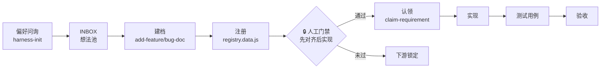

# Agent-Memory 研发 Harness 总纲

> 人 + 多 agent 共同遵循的研发流程。**核心原则：文件即队列，git 即锁，人只审核。**
> 本文是入口，细节链接到各规范文件。

## 全链路



## 角色分工

| 角色 | 职责 |
|--|--|
| 人 | 偏好选择、审核文档、点门禁通过 |
| agent | 建档、注册、认领、实现、测试、回写状态 |

## 1. 初始化偏好（首次接入）

运行 `/harness-init` 问询并写入 `.cursor/rules/harness-preferences.mdc` 受管块：文档展示形态（md/html/both）、语言、assignee 格式等。可重复运行覆盖。

## 2. 文档怎么写

- 范式与目录结构：见 [`docs/README.md`](README.md)（模块自洽、docs 内聚）。
- 建档用 `/add-feature-doc`、`/add-bug-doc`，不要手动 mkdir。
- **必读**：`docs/README.md §六·五 工程设计规范`（SRP/OCP/DIP/高内聚低耦合）、`§八 设计文档标准结构`（背景→目标→待确认问题→现状分析→初步方案，**简洁 + 图文并茂**）。

## 3. 需求与 Bug 怎么注册

- 单一事实来源（SSOT）：[`docs/requirements-registry.data.js`](requirements-registry.data.js) 的 `window.SEED_REQUIREMENTS`。
- 看板 [`docs/requirements-registry.html`](requirements-registry.html) 自动加载种子并展示。
- 字段：`id/title/type/module/path/created/phases/status/assignee/claimedAt/updatedAt`。
- 新增需求 = 往种子数组加一条 + 建对应文档目录。

## 4. 门禁怎么走（先对齐，后实现）

```
① 需求文档 → ② 设计文档 → 🔒 人工门禁 → ③ 代码实现 → ④ 测试用例 → ⑤ 测试报告
```

- 需求 + 设计文档都「已完成」→ 门禁进入「待审批」。
- 人点「通过门禁」→ agent 把种子里该需求 `gate:"passed"` 落盘提交（门禁回写闭环）。
- **未过门禁，禁止实现类编码。**

## 5. Agent 如何认领

运行 `/claim-requirement`：`git pull` → 选一条 claimable → 校验未占用 → 写 `assignee/status` → `commit/push`（冲突换一条）→ 干活 → 回写环节与 `status:done`。一次只认领一条；实现类任务必须 `gate=passed`。

## 6. 接入新项目（最小集）

```
docs/README.md                      规范
docs/requirements-registry.html     看板
docs/requirements-registry.data.js  SSOT（置空数组）
.cursor/rules/harness-engineering-spec.mdc  工程规范必读
```

完整体验另加：本文 `HARNESS.md`、`INBOX.md`、skills（add-feature-doc / add-bug-doc / claim-requirement / harness-init）。需定制：`README.md §二` 模块清单、注册中心模块下拉、assignee 格式。

> 未来可用 `Injector` 插件（见 `docs/hooks-adapter/features/spec-injector-plugin/`）一键注入以上全套到任意 IDE。
