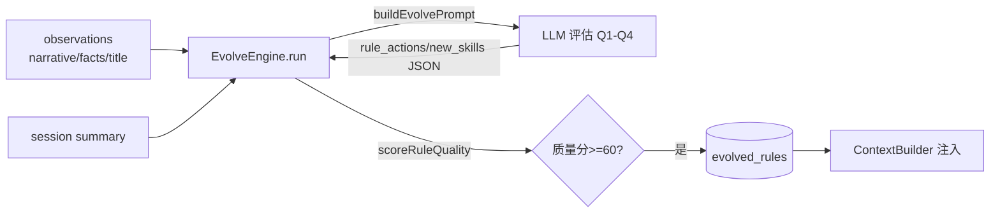

# self-evolve 内容操作 vs 规范约束 判别门禁 — 设计

## 1. 背景

见 [prd.md](prd.md)。核心痛点：self-evolve 把"一次性内容/代码处置"误判为"长期规范"，根因是**输入丢失前因后果 + 证据是 AI 转述 + 判别维度缺失**。

## 2. 需求目标

- 新增「内容操作 vs 规范约束」判别门禁，一次性处置不生成规则。
- 强制 `evidence` 为逐字原话，转述拒绝。
- 归档存量误判规则。

## 3. 需要确认的问题

1. 原话校验放 prompt 还是加程序化兜底？→ 本设计采用**两道一起**：prompt 约束 + EvolveEngine 轻量子串校验（可配置开关）。
2. observation 保留原话（目标 4）是否本期做？→ 设计为**可选增强**，不阻塞主链路；主链路先用现有 `narrative` 文本做子串校验。

## 4. 现状分析

### 4.1 现有数据流



问题点：
- `EvolveEngine.ts:86-108` 构造的 `evolveInput` 不含原始对话，`evidence` 无校验来源。
- `prompts/evolve.ts` 步骤2 的 Q1-Q3 没有"一次性 vs 持久"维度；Q1 要求原话但无法核验。
- `scoreRuleQuality`（`EvolveEngine.ts:548`）只看长度/指令词/paths，不看证据真伪。

### 4.2 关键接口

| 位置 | 现状 | 改动点 |
|---|---|---|
| `prompts/evolve.ts` 步骤2 | Q1-Q3 | 新增 Q0「一次性内容操作 → 直接不生成」；Q1 强化为"逐字原话，转述拒绝" |
| `EvolveEngine.processEvolveResult` / `run` | 仅质量分 | 新增 `verifyEvidenceIsVerbatim()` 兜底校验 |
| `db/rules.ts` | — | 复用现有 deprecate 能力归档 mem-1780 |

## 5. 初步解决方案

### 5.1 prompt 侧：新增 Q0 判别门（最高杠杆）

在步骤2 最前面加一道**前置判别**：

> **Q0 — 这是「对某次具体产物/文件/任务的一次性处置」，还是「可迁移到未来会话的行为约束」？**
> - 含具体产物/文件/版本/本次任务范围的处置（如"这次清理副本时保留原件""把这个文件改成X"）→ **一次性内容/代码操作 → 不生成规则**。
> - 与具体产物无关、描述"以后都要这样做"的行为约束 → 继续 Q1-Q3。

并将 Q1 改为：`evidence` 必须是用户**逐字原话**片段（带引号），**禁止填 AI 转述/摘要**；无法提供逐字原话 → 不生成。

### 5.2 引擎侧：轻量原话兜底校验（DIP/SRP）

新增纯函数 `verifyEvidenceIsVerbatim(evidence, sources): boolean`，独立于引擎主流程（单一职责）：

```text
- 归一化 evidence 与 observation 文本（去引号/空白）
- 若 evidence 去掉"用户说/明确表示"等转述前缀后，无法在任一 observation 文本中找到足够长的连续子串 → 判定为转述 → 拒绝该规则（rejectedRules++）
- 通过配置 config.verbatimEvidenceGate 开关，默认开
```

接入点：`run()` 与 `processEvolveResult()` 在 `scoreRuleQuality` 之前调用，未通过则 `rejectedRules++; continue`。

### 5.3 存量归档

一次性脚本/SQL：将 content = 「删除副本时保留原始生成内容」的规则 `status='deprecated'`，使其退出 `ContextBuilder` 注入（`getRulesByWorkspace` 已按 status='active' 过滤）。

### 5.4 目标 4（可选增强，后置）

observation 生成 prompt 增加 `user_quote` 字段，逐字保留触发性原话；`evolveInput` 透传该字段供 5.2 校验。本期不做，仅预留字段位。

## 6. 工程规范符合性

| 原则 | 落地 |
|---|---|
| SRP | 原话校验抽成独立纯函数，不混入 EvolveEngine 主流程 |
| OCP | Q0/校验通过 prompt 与配置开关扩展，不改既有质量打分逻辑 |
| DIP | 校验函数依赖传入文本而非具体 DB；observation 来源可替换 |
| 高内聚低耦合 | 全部改动收敛在 `src/plugins/self-evolve/`，对外接口不变 |

## 7. 风险

- 子串校验可能误杀"用户原话被合理改写大小写/标点"的情况 → 用归一化 + 最小连续片段阈值缓解，并保留开关。
- prompt Q0 过严可能漏掉"借一次性事件表达的长期偏好" → 由 Q0 文案明确"描述未来都要这样做"才放行。
