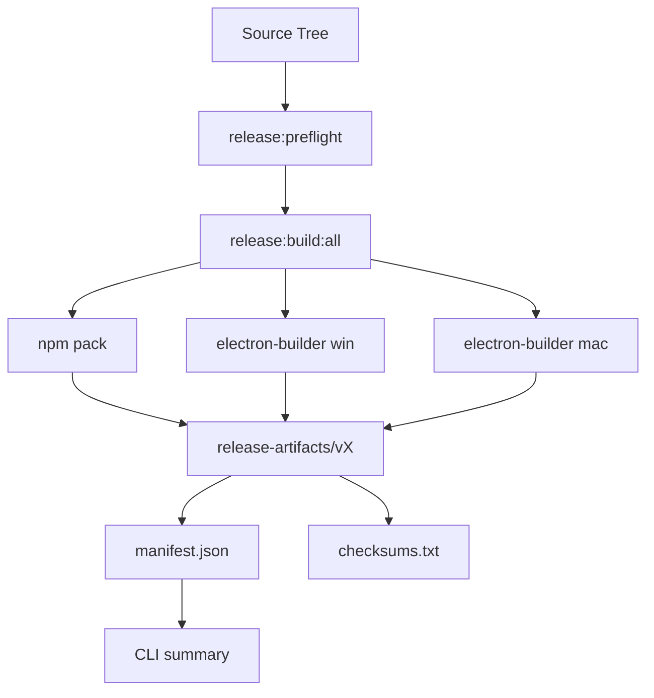

# 设计文档：统一发布自动化

> 日期：2026-04-27
> 关联 PRD：`2026-04-27-release-automation-prd.md`

## 架构



核心原则：

- 根 `package.json` 是唯一人工入口。
- `desktop/package.json` 只保留平台底层构建脚本。
- 所有人工可分发文件统一复制到 `release-artifacts/v<version>/`。
- 本地脚本不发布 npm、不创建 tag、不提交代码。

## 文件布局

新增：

```text
scripts/release/
  build-all.mjs
  clean.mjs
  preflight.mjs

release-artifacts/
  v2.0.2/
    npm/
    windows/
    macos/
    manifest.json
    checksums.txt
```

`release-artifacts/`、根目录 `*.tgz` 和 electron-builder 的 blockmap 临时文件全部加入 `.gitignore`。

## 脚本职责

### `scripts/release/preflight.mjs`

只做检查，不生成产物：

- 根包和桌面包版本必须一致。
- `CHANGELOG.md` 必须存在当前版本条目。
- 输出 git branch、commit 和工作区状态。
- 如果当前是 tag 构建，tag 名必须等于 `v<version>`。
- 默认允许存在本地改动，但打印警告；CI 中通过 `CI=true` 将警告升级为失败。

### `scripts/release/build-all.mjs`

本地和 CI 都使用同一个入口：

1. 运行 preflight。
2. 默认运行：
   - `npm run typecheck`
   - `npm test`
   - `npm run check:bun`
3. `npm pack --pack-destination release-artifacts/v<version>/npm`。
4. Windows：执行 `npm --prefix desktop run build:win`，复制 `desktop/release5/AgentMemory-Setup-<version>.exe` 和 blockmap。
5. macOS：执行 `npm --prefix desktop run build:mac:x64` 和 `build:mac:arm64`，复制 dmg 和 blockmap。
6. 非 macOS 默认跳过 macOS 构建并在 manifest 中记录 skipped。
7. 扫描产物生成 sha256、size、relative path。

环境变量：

- `RELEASE_TARGETS=npm,win,mac`：选择构建目标。
- `RELEASE_SKIP_TESTS=1`：跳过测试，仅用于快速本地验证。
- `RELEASE_ALLOW_DIRTY=1`：允许 CI 或本地带未提交改动构建。

### `scripts/release/clean.mjs`

- 删除 `release-artifacts/`。
- 删除根目录 stray `*.tgz` 和 `pack-info.json`。
- 删除 `desktop/release5/`。

## package scripts

根包新增：

```json
{
  "release:preflight": "node scripts/release/preflight.mjs",
  "release:pack:npm": "node scripts/release/build-all.mjs --targets npm",
  "release:build:win": "node scripts/release/build-all.mjs --targets npm,win",
  "release:build:mac": "node scripts/release/build-all.mjs --targets npm,mac",
  "release:build:all": "node scripts/release/build-all.mjs",
  "release:clean": "node scripts/release/clean.mjs"
}
```

## GitHub Actions

现有 release workflow 改为真实发布矩阵：

- `npm` job：Ubuntu，生成 npm tarball。
- `windows` job：Windows，生成 NSIS exe。
- `macos` job：macOS，生成 x64/arm64 dmg。
- `release` job：下载所有 artifact，发布到 GitHub Release。

说明：

- GitHub Actions 只上传 GitHub Release 附件，不执行 `npm publish`。
- 如果后续需要 npm 发布，另加手动 workflow dispatch 并要求 `NPM_TOKEN`。

## Skill 设计

新增 `.cursor/skills/release-agent-memory/SKILL.md`：

- 描述触发：打包、发版、发布、npm 包、Windows exe、macOS dmg。
- 强制顺序：preflight → build → manifest 汇总。
- 明确安全规则：没有用户明确要求时不 `npm publish`、不 git tag、不卡掉用户本地改动。

## 验证

本地 Windows 验证：

```bash
npm run release:preflight
npm run release:pack:npm
npm run release:build:win
```

CI 验证：

- 推送 tag `v<version>`。
- 检查 GitHub Release 附件包含 npm、Windows、macOS、manifest、checksums。
